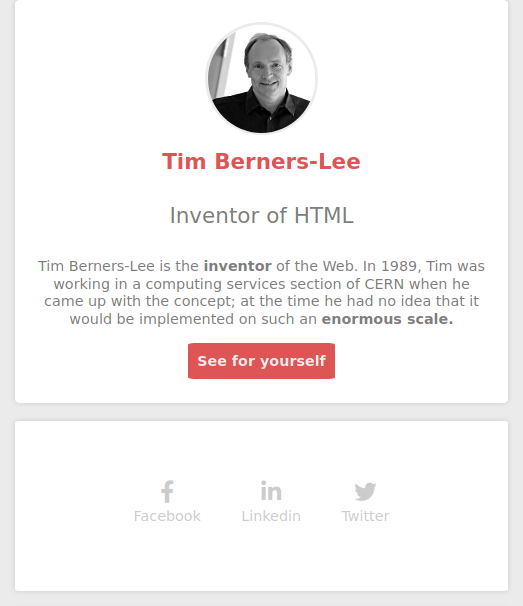

# Website Tim Berners-Lee

### Date of realization :
January 2021

### Status :
Completed project

### Type of project :
Exercise

### Context :
Project carried out as part of the "Junior web developer" training [@ BeCode] (https://becode.org/)

### Languages :
* HTML
* CSS

### Learning objectives :
1. Understand the principles of HTML and CSS

### Instructions link :
[Click here](https://github.com/becodeorg/LIE-Jepsen-4.27/blob/master/01-the-field/04-html-css/01-fundamentals/06-tim-berners-lee.md)

### Images of the project :

